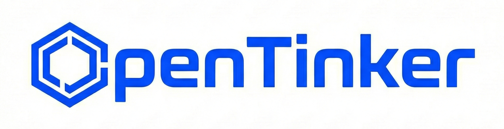

<div align="center" id="opentinker">
  

  <p style="margin-top: 6px; font-size: 18px;">
    <em>Democratizing Agentic Reinforcement Learning as a Service</em>
  </p>

  <p>
    <a href="https://open-tinker.github.io/opentinker-page/">Project Page</a> ·
    <a href="https://deepwiki.com/open-tinker/OpenTinker">DeepWiki</a> ·
    <a href="https://join.slack.com/t/opentinker/shared_invite/zt-3lnxuxkfr-QZpzObNvW0DtcQUWzvKtQg">Slack</a> ·
    <a href="https://raw.githubusercontent.com/open-tinker/Assets/c94528fbb429d32bbd9896eec0ffc7e14172afd3/wechat_group.JPG">Wechat</a>
  </p>
</div>

## 🚀 Quick Start

Choose an example below to get started. Each example includes step-by-step instructions for setup, training, and inference.

| Task                                             | Description                                                                          | Performance                                                                       |
| ------------------------------------------------ | ------------------------------------------------------------------------------------ | --------------------------------------------------------------------------------- |
| **[LLM Single-Turn Math](docs/math_singleturn.md)**                       | Mathematical problem solving                                     | [wandb](https://wandb.ai/zsqzz/Open-Tinker/runs/bwkq1wl8?nw=nwuserzhusq20)                                                                               |
| **[LLM Multi-Turn Math](docs/math_multiturn.md)** | Multi-turn mathematical problem solving with tool calling                          | [wandb](https://wandb.ai/zsqzz/Open-Tinker/runs/f5pt6gcw?nw=nwuserzhusq20)                       |
| **[LLM Single-LoRA Single-Turn Math](docs/math_lora_singleturn.md)**                  | Math single-turn Trained With LoRA                                                         | [wandb](https://wandb.ai/zsqzz/Open-Tinker/runs/cl1w5l07?nw=nwuserzhusq20)                        |
| **[VLM Single-Turn Math](docs/vlm_geo3k_singleturn.md)**                    | geometry 3k math problem solving                                                          | [wandb](https://wandb.ai/zsqzz/Open-Tinker/runs/aidfc2y1?nw=nwuserzhusq20)                                                                               |
| **[VLM Multi-Turn Math](docs/vlm_geo3k_multiturn.md)**             | geometry 3k math problem solving with tool calling                                           | [wandb](https://wandb.ai/zsqzz/Open-Tinker/runs/r39htm2o?nw=nwuserzhusq20)                |
| **[LLM Gomoku Agent](docs/gomoku_multiturn.md)**       | A multi-turn gomoku agent | [wandb](https://wandb.ai/zsqzz/Open-Tinker/runs/7a7ggkw3?nw=nwuserzhusq20)                        |
| **[LLM AlfWorld Agent](docs/alfworld_multiturn.md)**       | A multi-turn alfworld agent | [wandb](https://wandb.ai/1125027232/opentinker-public/runs/3jrlolk7?nw=nwuser1125027232)                        |


## 📦 Installation

### 🔹 Common Setup (Client and Server)

#### Clone the Repository

```bash
git clone --recurse-submodules https://github.com/open-tinker/OpenTinker.git
cd OpenTinker
```

#### Install OpenTinker

```bash
pip install -e .
```

#### Install verl (core package)

```bash
cd verl
pip install -e .
cd ..
```

### 💻 Client Setup

After completing the Common Setup, no additional steps are needed.

> **Note**
> The client currently relies on a small subset of functions from `verl`. This dependency is transitional. In future releases, the client will be fully decoupled from `verl`, allowing it to remain completely lightweight and independent of training-related code.

### 🧠 Server Setup

In addition to the Common Setup, it must install verl dependencies.

You can choose one of the following two approaches.

#### Option 1: Docker Installation (Recommended)

```bash
# Pull the verl Docker image
docker pull verlai/verl@sha256:3ce56ff018516b28ab9c4f4fc09d3aa67589074495ace75e2674b720aa4d0e5d

# Create and run container
docker run -dit \
  --gpus all \
  --restart=no \
  --entrypoint /bin/bash \
  --net=host \
  --shm-size=10g \
  --cap-add=SYS_ADMIN \
  -v .:/workspace/dev \
  --name tinker \
  verlai/verl@sha256:3ce56ff018516b28ab9c4f4fc09d3aa67589074495ace75e2674b720aa4d0e5d
```

#### Option 2: Manual Installation

you can install verl dependencies manually. After completing the Common Setup, run:

```bash
cd verl
pip install -r requirements.txt
cd ..
```

This installs all GPU and training-related dependencies required by the server.

⚠️ **Warning**
Manual installation may introduce version conflicts. For better stability and reproducibility, we recommend using the Docker-based setup whenever possible.

## 🔐 Authentication

OpenTinker includes a built-in authentication system to secure access to the scheduler API.

### Configuration

Edit `opentinker/scheduler/config/scheduler.yaml`:

```yaml
enable_auth: true # Set to true to enable authentication, false to disable authentication.
user_db_path: "scheduler_users.db"
```

### Quick Registration

Run the server to set up the backend:

```bash
chmod +x opentinker/scripts/launch_scheduler.sh
opentinker/scripts/launch_scheduler.sh
```

Run the interactive script to register a user and get an API key:

```bash
python opentinker/scheduler/register_user_example.py
```

For advanced usage (REST API registration, using the key) and detailed configuration, see the [Scheduler & Dashboard Guide](opentinker/scheduler/SCHEDULER_GUIDE.md#authentication).

## 🎮 Environments

OpenTinker provides a flexible environment design framework that supports diverse training scenarios. Our architecture accommodates two orthogonal dimensions:

- **Data Source**: _Data-Dependent_ environments load structured datasets (e.g., parquet files) to provide prompts, while _Data-Free_ environments generate prompts dynamically from simulators or game engines.
- **Interaction Mode**: _Single-Turn_ environments involve one-shot model responses, while _Multi-Turn_ environments enable iterative interactions with tool calls and feedback loops.

This 2×2 design space enables four distinct paradigms, each suited to different learning objectives:

| Paradigm                         | Data Source | Interaction | Example Use Case                      |
| -------------------------------- | ----------- | ----------- | ------------------------------------- |
| **Data-Dependent × Single-Turn** | Dataset     | One-shot    | Math reasoning, QA tasks              |
| **Data-Dependent × Multi-Turn**  | Dataset     | Iterative   | Tool-assisted problem solving         |
| **Data-Free × Single-Turn**      | Simulator   | One-shot    | Bandit                                |
| **Data-Free × Multi-Turn**       | Simulator   | Iterative   | Complex game playing, dialogue agents |

## 📚 Documentation

- [Scheduler & Dashboard Guide](opentinker/scheduler/SCHEDULER_GUIDE.md) - Configuration, Usage, and Web Dashboard

## 📖 Citation

```
@misc{opentinker2025,
  title        = {OpenTinker: Democratizing Agentic Reinforcement Learning as a Service},
  author       = {Siqi Zhu and Jiaxuan You},
  year         = {2025},
  howpublished = {\url{https://github.com/open-tinker/OpenTinker}},
  note         = {GitHub repository}
}
```
